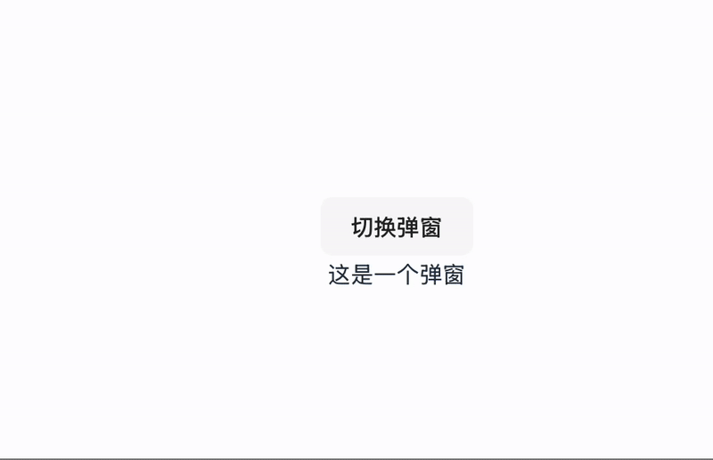

# Description for react-project1
This project contains various examples demonstrating the usage of React's useState and useEffect hooks.

# code blocks
```JavaScript
//总体的分类思想, which is: integrate everything in one main code! 
import { BrowserRouter as Router, Routes, Route, Link } from 'react-router-dom';
import EffectOne from './components/EffectOne';
import EffectTwo from './components/EffectTwo';

function App() {
  return (
    <Router>
      <nav>
        <ul>
          <li><Link to="/effect-one">效果一</Link></li>
          <li><Link to="/effect-two">效果二</Link></li>
        </ul>
      </nav>
      <hr />
      <Routes>
        <Route path="/effect-one" element={<EffectOne />} />
        <Route path="/effect-two" element={<EffectTwo />} />
      </Routes>
    </Router>
  );
}
export default App;
```

```jsx
//code block 1: boolean
import { useState } from "react";
import "./App.css"; // 引入 CSS 文件

function ModalExample() {
  const [isOpen, setIsOpen] = useState(false);

  return (
    <>
      <button onClick={() => setIsOpen(!isOpen)}>切换弹窗</button>
      {isOpen && <div>这是一个弹窗</div>}
    </>
  );
}

export default ModalExample;
```
demo -1:


```jsx
//2: number
import { useState } from "react";

function Counter() {
  const [count, setCount] = useState(0);

  return (
    <>
      <p>计数: {count}</p>
      <button onClick={() => setCount(count + 1)}>增加</button>
      <button onClick={() => setCount(count - 1)}>减少</button>
    </>
  );
}
```

```jsx
//3: string
import { useState } from "react";
function InputExample() {
  const [text, setText] = useState("");

  return (
    <>
      <input
        value={text}
        onChange={(e) => setText(e.target.value)}
        placeholder="输入文字"
      />
      <p>你输入了: {text}</p>
    </>
  );
}

```

```jsx
//4: object/array
import { useState } from "react";

function Cart() {
  const [cart, setCart] = useState([]);

  const addItem = (item) => {
    setCart([...cart, item]);
  };

  return (
    <>
      <button onClick={() => addItem("苹果")}>加入苹果</button>
      <button onClick={() => addItem("香蕉")}>加入香蕉</button>
      <ul>
        {cart.map((item, index) => (
          <li key={index}>{item}</li>
        ))}
      </ul>
    </>
  );
}

```

# Setup Instructions

**take code block 1 for example:** \
1 in the vscode terminal, run:\
1-1 cd /Users/roger/Desktop/my-programming-journey/Programming-Projects/react-state-and-effects \
1-2 npm create vite@latest\
1-3 name the project: react-project1; \
seclect a framework: react;\
 a variant: JavaScript + SWC;\
1-4 cd react-project1\
npm install\
npm run dev (**command+local link in vscode terminal**) \
1-5 click following path: /Users/roger/Desktop/my-programming-journey/Programming-Projects/react-state-and-effects/react-project1/src/App.jsx, replace the existing codes with code block 1. \
1-6 bonus: no need to run npm start, an advantange vite over CRA.


